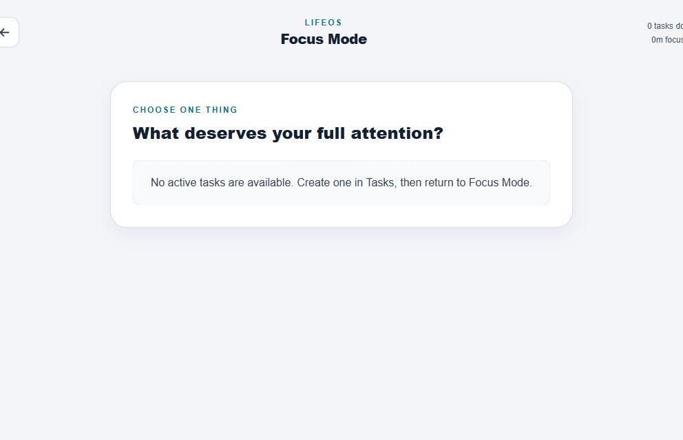
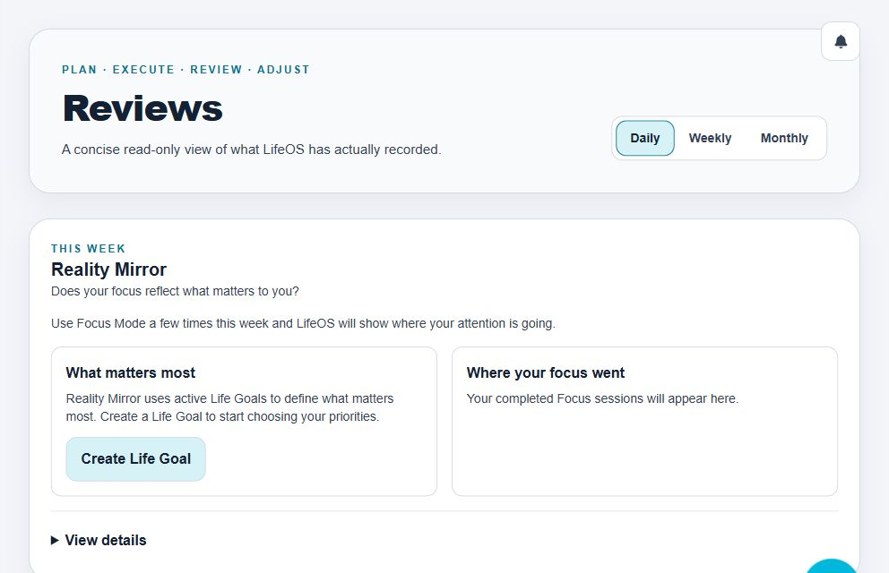
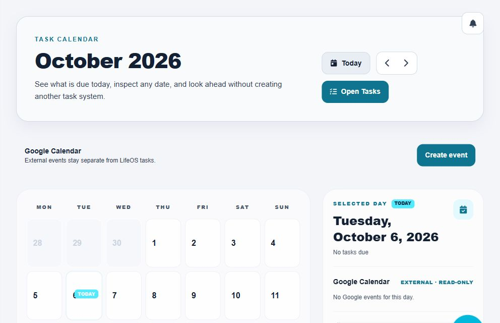
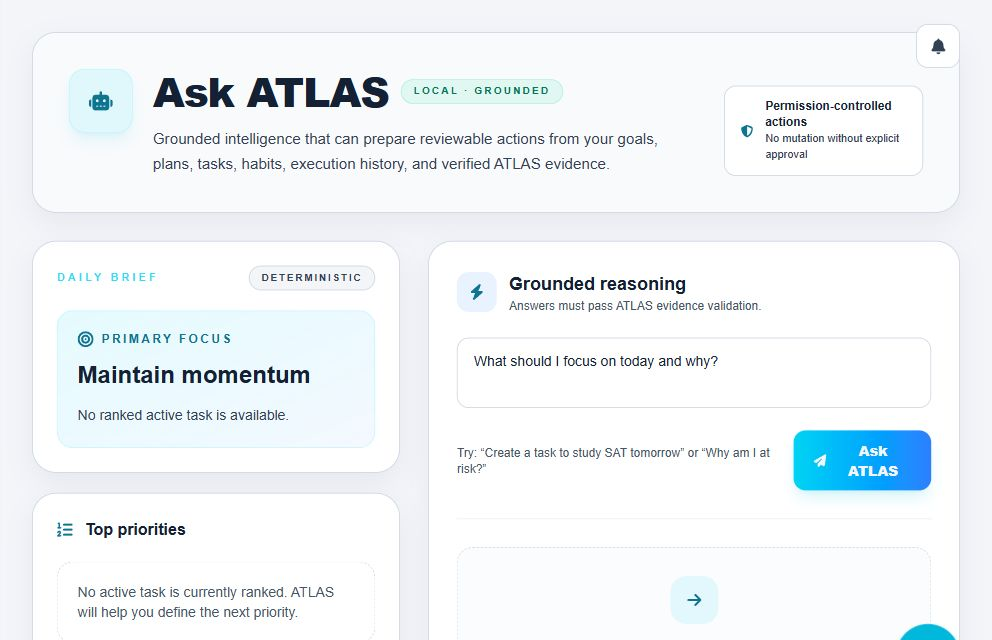

# LifeOS

A personal operating system for planning, execution, reflection, and intelligent life management.

**Plan what matters. Focus on it. See where your attention actually went. Improve the next week.**

LifeOS connects goals, tasks, habits, focus sessions, reviews, and external calendar context in one responsive web application. Its intelligence is grounded in trusted application state; proposed actions stay behind explicit approval.

[Product](#what-works-today) · [Architecture](ARCHITECTURE.md) · [Setup](docs/SETUP.md) · [Roadmap](ROADMAP.md)


*Primary focus, trusted daily summaries, calendar context, and quick navigation.*

## What works today

| Area | Implemented experience |
| --- | --- |
| Planning & execution | Life Goals → Monthly Outcomes → Weekly Focus → Tasks; personal planning; execution history and ledger-derived XP. |
| Focus | Task-linked Focus Mode, pause-aware timestamps, reload recovery, and a separate choice to complete the task. |
| Habits & reflection | Scheduled habits, completion history, derived streaks; factual Daily, Weekly, and Monthly Reviews. |
| Reality Mirror | User-declared priorities compared with recorded Focus durations; weekly balance and expandable evidence. |
| ATLAS | Deterministic Daily Brief, priorities, risks and signals; grounded questions; explicit Memory; permissioned action proposals. |
| Calendar | Canonical task dates plus separate Google events; OAuth reads and explicitly approved event creation. |
| System | Supabase Auth, account-scoped PowerSync persistence, offline/reconnect foundations, notifications, captures, Light / Dark / System appearance. |

### See the interface

Real light-mode captures of an empty workspace, not populated demo data. All images are 992 × 640 crops excluding account/profile chrome.

<details>
<summary>Focus Mode — entry state</summary>



Focus starts from an active task. This is the no-task state, not a fabricated running session.

</details>

<details>
<summary>Reality Mirror — setup state</summary>



Recorded focus is not a claim about every hour of someone's life.

</details>

<details>
<summary>Calendar — Google Calendar integration</summary>



External events remain separate from canonical Tasks. The visible day has no events.

</details>

<details>
<summary>Ask ATLAS — grounded interaction</summary>



Deterministic summaries need no language model. Natural-language answers need a configured provider.

</details>

## Why LifeOS is different

- **Canonical domain ownership.** Trusted engines and repository boundaries own behavior and persistence; React consumes their state.
- **Attention, not just checkboxes.** Reality Mirror compares intended priorities with recorded Focus time, with explicit coverage limitations.
- **Evidence before commentary.** ATLAS builds a deterministic Fact Core and reconstructs citations from validated references. Models never become factual authority.
- **Approval before action.** Untrusted candidates pass schema, reference, and permission checks before a proposal can be approved and executed.
- **No hidden connector mutations.** Reading Google events does not create Tasks or award XP. Writes require exact approval. Mock messaging and finance remain simulations.

## Architecture at a glance

```text
React UI → domain contexts → trusted mutation/execution engines
                              ↓
                       typed repositories
                              ↓
                  per-user PowerSync database
                              ↕
                   Supabase Postgres + RLS

Canonical state → reasoning context → deterministic Fact Core
                                       ↓
                        provider commentary + references
                                       ↓
                            strict validation
                                       ↓
                        deterministic answer + citations
```

Actions use a separate permission → proposal → explicit approval → trusted executor path. Memory is contextual and non-citable. Hosted Gemini, Qwen, and Mistral adapters exist, but comparison and production selection are unfinished. Hosted AI is not required for deterministic functionality.

See [architecture and safety boundaries](ARCHITECTURE.md).

## Google Calendar security

Authorization Code + PKCE, exact redirect allowlisting, server-side token exchange/refresh, and encrypted token storage protect the connection. Read scopes and event-creation permission are separate. Writes require an approved exact payload and duplicate-prevention bookkeeping. Google events stay separate from Tasks; credentials and tokens stay out of browser configuration.

## Technology

| Layer | Stack |
| --- | --- |
| Frontend | React 19, TypeScript 6, Vite 8 |
| Presentation | Tailwind CSS 4, semantic tokens, Framer Motion, Recharts |
| State | Context-based domain providers and pure engines |
| Auth / backend | Supabase Auth, Postgres RLS, Edge Functions |
| Database / sync | PowerSync Web, account-scoped SQLite databases |
| Tests | Node test runner, separate TypeScript test project, fake storage/transport |

## Run locally

Use Node.js 24 and npm:

```sh
npm install
npm run dev
```

**The normal app is authentication-gated.** Opening a workspace requires configured Supabase Auth and PowerSync infrastructure. Without those prerequisites you can build and run deterministic tests, but there is no guest demo mode.

See [setup](docs/SETUP.md) for client configuration, backend prerequisites, and optional Google Calendar / ATLAS setup. Never put server secrets in `VITE_*`.

## Quality and verification

Deterministic coverage spans intelligence, permissions, connectors, planning, habits, execution/XP, persistence, account isolation, focus, reviews, and notifications. The preceding checkpoint verified the full deterministic suite, clean test-project typecheck, production build, and focused lint. This checkpoint changes documentation and images only.

```sh
npx tsc -p tests/tsconfig.json --noEmit
npm run test:atlas
npm run test:hosted-atlas
npm run test:google-calendar
npm run test:focus
npm run test:reality-mirror
npm run build
```

Additional suites are in [package.json](package.json). Live infrastructure tests are separate from offline verification. There is no CI badge; focused lint does not imply repository-wide lint debt is resolved.

## Status and direction

LifeOS is a personal project under active development. Data correctness, understandable UX, and explicit authority boundaries take priority over feature speed.

Richer reviews/focus insights, additional connectors, hosted ATLAS after provider selection, voice, and mobile packaging are **planned**, not shipping capabilities. See the [roadmap](ROADMAP.md).

For contributions, open a focused proposal first. Preserve domain ownership, add deterministic coverage, and never submit credentials or private screenshots. No license is currently declared; repository visibility alone does not establish usage rights.
